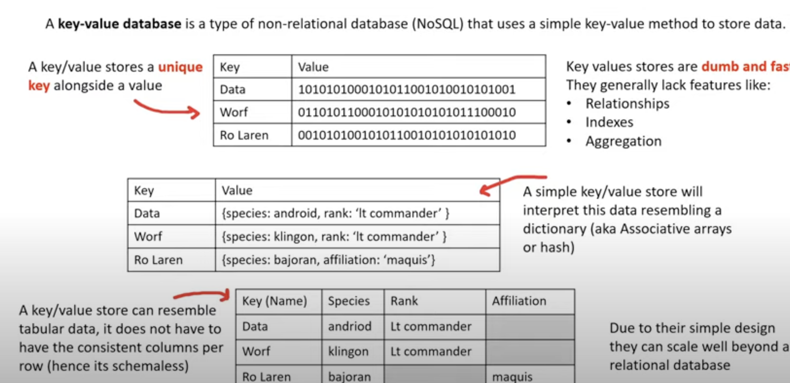
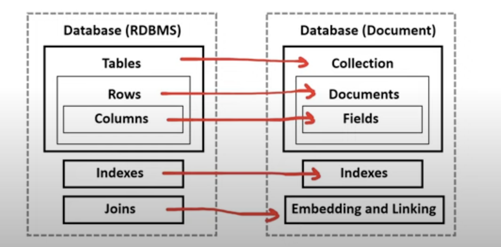

## What is Data Warehouse?

A relational datastore designed for analytic workloads, which is generally column-oriented data-store

Companies will have terabytes and millions of rows of data, and they need a fast way to be able to produce analytics reports

Data warehouses generally perform aggregation
- aggregation is grouping data eg. find a total or average
- Data warehouses are optimized around columns since they need to quickly aggerate column data

Data warehouses are generally designed be HOT
- Hot means they can return queries very fast even though they have vast amounts of data

Data warehouses are infrequently accessed meaning they aren't intended for real-time reporting but maybe once or twice a a day or once a week to generate business and user reports.

A data warehouse needs to consume data from a relational databases on a regular basis.

## What is a key/value store?

 

## What is document store?
A document store is a NOSQL database that stores documents as its primary data structure.

A document could be an XML but more commonly is JSON or JSON-Like
Document stores are sub-class of Key/Value stores

The components of a document store compared to Relational database

 

## Amazon NoSQL Database Services
- DynamoDB is a serverless NoSQL key/value and document database. It is designed to scale to billions of records with guaranteed consistent data return in at least a second. You don't have to worry about managing shards!

    - DynamoDB is AWS's flagship database service meaning whenever we think of a database service that just scales, is cost effective and very fast we should think DynamoDB

    - In 2019, Amazon the online shopping retail shutdown their last Oracle database and completed their migration to DynamoDB. They had 7,500 Oracle Database and 75 petabytes of data. With DynamoDB they reduce costs by 60% and reduce latency by 40%

    - When we want a massively scalable database

- DocumentDB is a NoSQL document database that is "MongoDB compatible"
MongoDB is very popular NoSQL among developers. There were open-source licensing issues around using open-source MongoDB, so AWS got around it by just building their own MongoDB database. When you want a MongoDB database.

- Amazon Keyspaces is a fully managed Apache Cassandra database. Cassandra is an open-source NoSQL key/value database similar to DynamoDB in that is columnar store database but has some additional functionality. When you want to use Apache Casandra.

## Amazon Relational Database Services
Relational Database Service (RDS) is a relational database service that supports multiple SQL engines. Relational is synonymous with SQL and Online Transactional Processing (OLTP). Relational database are the most commonly used type of database among tech companies and start-ups.

RDS Supports the following SQL Engines:
- MySQL - The most popular open-source SQL database that was purchased and now owned by Oracle.
- MariaDB - When Oracle bought MySQL. MariaDB made a fork (copy) of MySQL was made under a different open-source license.
- Postgres (PSQL) - Most popular open-source SQL database among developers. Has rich-features over MySQL but at added complexity
- Oracle - Oracle's proprietary SQL database. Well used by Enterprise companies. You have to buy a license to use it
- Microsoft SQL Server - Microsoft's proprietary SQL database. You have to buy a license to use it.
- Aurora - Fully managed database.
    - Aurora is a fully managed database of either MySQL (5x faster) and PSQL (3x faster) database.
    - When you want a highly available, durable, scalable and secure relational database for Postgres or MySQL
    - Aurora Serverless is the serverless on-demand version of Aurora. When you want "most" of the benefits of Aurora but can trade to have cold-starts or you don't have lots of traffic demand

- RDS on VMware allows you to deploy RDS supported engines to on an-premise data-center. The datacenter must be using VMware for server virtualization.

## Other Amazon Database Services
- Redshift is a petabyte-size data-warehouse. Data-warehouses are for Online Analytical Processing (OLAP)
Data-warehouses can be expensive because they are keeping data "hot". Meaning that we can run a very complex query and a large amount of data and get that data back very fast. 
When you to quickly generate analytics or reports from a large amount of data.

- ElastiCache is a managed database of the in-memory and caching open-source databases Redis or Memcached.
When you need to improve the performance of application by adding a caching layer in-front of web-server or database.

- Neptune is a managed graph database. Data is represented as interconnected nodes.
When you need to understand the connections between data eg. Mapping Fraud Rings or Social Media relationships

- Amazon Timestreams is a fully managed time series database. Think of devices that send lots of data that are time-sensitive such as loT devices. When you need to measure how things change over time.

- Amazon Quantum Ledger Database is a fully managed ledger database that provides transparent, immutable and cryptographically variable transaction logs.
When you need to record history of financial activities that can be trusted.

- Database Migration Service (DMS) is database migration service. You can migrate from:
    - on-premise database to AWS
    - from two database in different or same AWS accounts using different SQL engines
    - from an SQL to NoSQL database