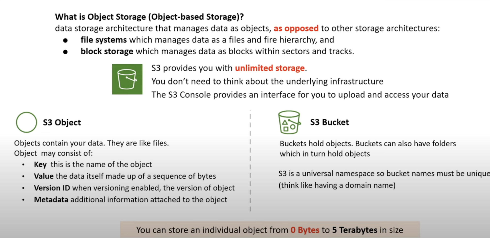

 

## Storage Classes
from expensive to cheaper one:

- S3 Standard (default)
Fast! 99.99% Availability, 11 9's Durability. Replicated across at least three AZs
- S3 Intelligent Tiering
Uses ML to analyze object usage and determine the appropriate storage class.
Data is moved to the most cost-effective access tier, without any performance impact or added overhead.
- S3 Standard-IA (Infrequent Access)
Still Fast! Cheaper if you access files less than once a month.
Additional retrieval fee is applied. 50% less than Standard (reduced availability)
- S3 One-Zone-IA
Still Fast! Objects only exist in one AZ. Availability (is 99.5%). but cheaper than Standard IA by 20% less (Reduce durability) Data could get destroyed. A retrieval fee is applied.
- S3 Glacier
For long-term cold storage. Retrieval of data can take minutes to hours but the off is very cheap storage
- S3 Glacier Deep Archive
The lowest cost storage class. Data retrieval time is 12 hours.

## AWS Snow Family
AWS Snow Family are storage and compute devices used to physically move data in or out the cloud when moving data over the internet or private connection it to slow, difficult or costly.

- Snowcone
Comes in two sizes:
• 8 TB of Storage (HHD)
• 14 TB of Storage (SSD)

- Snowball Edge
Comes generally in two type:
• Storage Optimized
• 80 TB
• Compute Optimized
• 39.5 TB

- Snowmobile
100 PB of storage